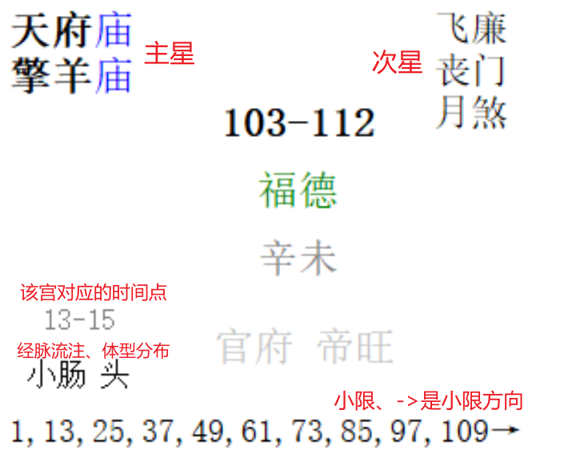

# ziweidoushu-release

## 版本1.0.0

1、输入红色内容的信息，点击蓝色框内的“开始排盘”，显示如下：

宫内介绍如下：

**注意事项：**

1）农历闰月，需在数字前面输入“闰”字，比如“闰3”。

2）生于“子时”的人，以现代的日期时间习惯来使用即可。

比如：3日23:30，即为3日的夜子时；4日00:30，即为4日的早子时

2、点击“保存”可以保存当前人员的信息，点击“加载”可以加载保存过的人员信息，如下：

3、点击数据，会选中一行，右下角有三个按钮，根据需求进行操作

4、其他功能

5、浪水茕：yw_forgit@163.com